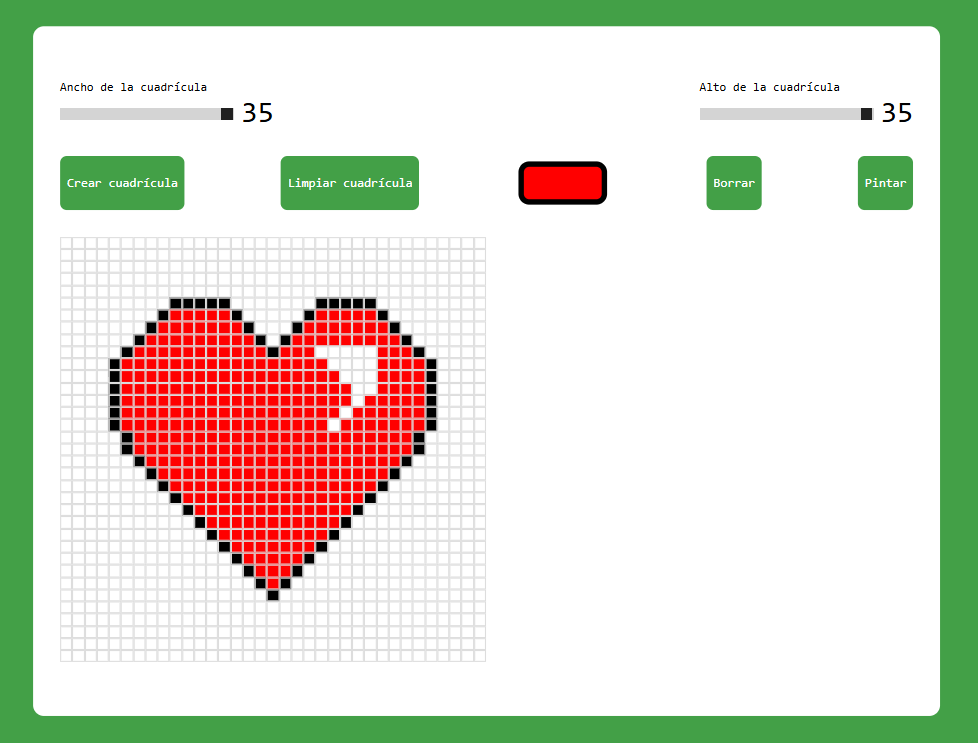

# 🎨 Generador de Pixel Art 

Un generador de pixel art interactivo que permite crear arte digital pixel por pixel. Este es el proyecto #1 de mi desafío personal de [100 días de JavaScript](https://github.com/gianmattus-programmer/100-DIAS-DE-JS).

✨ Características

- 🎯 Crea una cuadrícula personalizable (hasta 35x35)
- 🎨 Selector de colores integrado
- ✏️ Herramientas de dibujo y borrado
- 🔄 Botón para limpiar el lienzo
- 📱 Totalmente responsivo
- 🖱️ Compatible con mouse y dispositivos táctiles

## 🚀 Demo en vivo

[¡Prueba el generador aquí!](#) 

## 💻 Guía rápida de uso

<table>
<tr>
<td>

### 🎯 Crear cuadrícula
1. Ajusta el ancho y alto (máx. 35x35)
2. Click en "Crear cuadrícula"

</td>
<td>

### 🎨 Dibujar
1. Selecciona un color
2. Click o arrastra para pintar
3. Usa "Borrar" para corregir

</td>
</tr>
</table>

## ⚡ Atajos de teclado

| Tecla | Función |
|-------|---------|
| `B` | Modo borrador |
| `P` | Modo pintar |
| `C` | Limpiar cuadrícula |
| `Espacio` | Selector de color |

## 🌟 Autor

**[@Gianmattus-Programmer](https://github.com/Gianmattus-Programmer)** 

---

⌨️ con ❤️ por [Gianmattus-Programmer] | 🌟 ¡Dale una estrella si te gustó! 🌟

